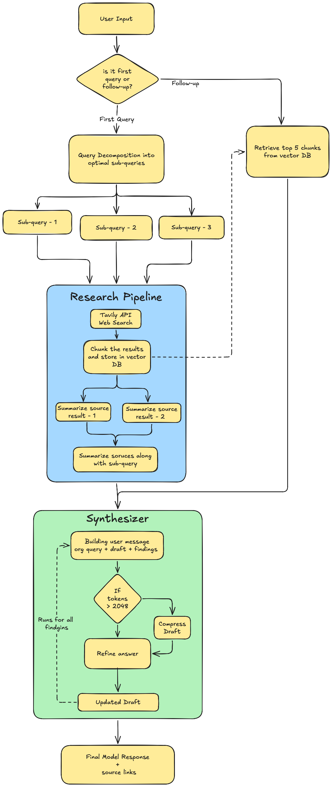

# Deep Research Agent


## Architecture Diagram



The diagram shows the complete pipeline: initial query routing (first query vs. follow-up), the research pipeline (decomposition → web search → chunking → summarisation), the synthesis loop with budget enforcement, and the RAG retrieval path for conversational follow-ups.

---

## 1. Constraint Definition

| Constraint | Value | Rationale |
|---|---|---|
| **Max research-context tokens per LLM call** | 2,048 | Tight enough to force real memory management; loose enough to produce useful summaries. System prompt tokens are excluded and only the dynamic research content counts against this budget. |
| **Max cost per research session** | < $0.05 | Ensures the agent is economically viable for real-world deployment at scale. Verified locally across multiple test sessions (see Section 9). |

Every LLM call is routed through a single `call_llm` wrapper (`agent/llm.py`) that:
1. Counts `context_tokens = count_tokens(user_message)` with `tiktoken` **before** the API call.
2. Raises a `ValueError` if it exceeds 2,048, guaranteeing hard enforcement at runtime.
3. Records both `context_tokens` (the constrained value) and `prompt_tokens` (the full API prompt including system instructions) in the `BudgetTracker` for post-session analysis.
4. Automatically retries up to 4 times with exponential backoff.

The per-call context token count is surfaced in the UI side panel as a bar chart, making constraint compliance visually verifiable on every query.

---

## 2. Memory Architecture — Why a Hybrid?

The agent uses three memory tiers working together:

| Tier | Mechanism | Role |
|---|---|---|
| **Long-term** | ChromaDB vector store | Stores every raw research chunk as an embedding. Never occupies context window tokens during research. |
| **Compression** | Summarisation cascade (3 levels) | Raw text → source summary (~400 tok) → sub-query finding (~400 tok). Budget-safe at each level. |
| **Active** | Working-memory buffer (FIFO eviction) | Fixed-size buffer that holds only what the LLM needs right now. Oldest findings evicted first. |

### Why not pure Vector RAG?

Vector search alone retrieves the *k* most similar chunks to the current query. Under a 2K budget that means ~3-5 short fragments. The problem: chunks are decontextualised where the LLM receives isolated sentences with no narrative structure. Answer quality degrades badly when the question requires synthesis across multiple sources.

### Why not pure summarisation?

Summarisation compresses well but is lossy. If a later follow-up needs a specific statistic that was compressed away during the initial research session, it's gone permanently. Keeping raw chunks in the vector store means follow-ups can *re-retrieve* precise details on demand and no re-searching required.

### The hybrid advantage

The cascade handles the "wide view" (compressed summaries for synthesis), while the vector store provides "zoom-in" capability (retrieve specific chunks for follow-up precision). Both remain within the 2K budget because summaries are short and vector retrievals are top-k bounded.

---

## 3. Synthesis Strategy: Iterative Refinement

The agent builds the final answer one sub-query at a time:

```
draft₀ = ""
for each sub-query finding fᵢ:
    user_block = original_question + draft_so_far + fᵢ
    if tokens(user_block) > 2048:
        draft = compress_draft(draft, target=1800 tokens)  ← safety valve
        user_block = rebuilt with compressed draft
    draft = LLM(user_block, max_output=8000)
return draftₙ
```

### Alternatives considered

| Strategy | Pros | Cons |
|---|---|---|
| **Iterative refinement** (chosen) | Coherent narrative; each step sees full evolving answer; naturally stays in budget | Later sub-queries can overshadow earlier ones if draft is compressed |
| **Hierarchical merge** | Balanced information weight | More LLM calls; loses coherence across branches |
| **Section-by-section** | Simple; easy to parallelise | No cross-section awareness; disjointed output |

Iterative refinement was chosen because it produces the most coherent prose and mirrors how a human researcher would incrementally build understanding.

### Draft self-compression

When the running draft exceeds `max_draft_tokens` (1,800), it is compressed before the next iteration using `gpt-4o-mini`. This is a deliberate lossy trade-off for staying within the memory constraint. The compression target was chosen to leave enough tokens of headroom for the next sub-query finding within the 2,048 budget.

---

## 5. Sub-Query Cap — Why 3?

The decomposer LLM generates 2–5 sub-queries, but the pipeline caps execution at 3. This is a deliberate architectural decision driven by the token budget math of iterative synthesis.

### The constraint arithmetic

With `max_context_tokens = 2048` and `max_draft_tokens = 1800`:

| Sub-queries | Synthesis rounds | Budget pressure at round N | Compress fires? |
|---|---|---|---|
| 2 | 2 | 248 tokens free for finding | Rarely |
| **3** | **3** | **~248 tokens free by round 3** | **Occasionally** |
| 5 | 5 | Draft hits 1800 before round 4 | Every session |
| 7 | 7 | Forced compression rounds 3–7 | Every round after 2 |

At 5+ sub-queries, the growing draft triggers repeated compression cycles. I noticed that each compression is lossy, detail from early sub-queries is discarded to make room for later findings. The result was a *longer* pipeline that paradoxically produced a *less coherent* answer, because the compressor strips nuance that the synthesiser needed.

At 3 sub-queries, the iterative refinement architecture operates cleanly: the draft stays within budget in most sessions, compression fires only for very broad queries, and each synthesis call has meaningful context available. This was verified across multiple test sessions locally.

**The cap is not about laziness rather it is about the constraint itself dictating the optimal operating point.** The 2,048-token budget, 1,800-token draft ceiling, and ~400-token sub-query finding size mathematically converge on 3 as the coherence-preserving maximum.

---

## 5. Two-Model Architecture 

The pipeline uses two different models, applied strategically:

| Steps | Model | Rationale |
|---|---|---|
| Decompose, classify, summarise sources, summarise sub-queries, compress draft | `gpt-4o-mini` | Structured output tasks such as JSON arrays, short summaries, compression. Fast and cheap. Output correctness is objectively verifiable. |
| Iterative synthesis (refine) | `gpt-5-mini` (reasoning model) | Multi-step analytical writing across 3 research threads. Benefits from internal chain-of-thought before generating output. |

### Why gpt-5-mini only for synthesis?

The insight is functional differentiation: **not all LLM calls benefit equally from reasoning**.

- `decompose` returns a JSON list — parseable or not, no reasoning needed.
- `summarise_source` compresses text to ≤400 tokens  deterministic, verifiable output.
- `classify` returns one word, `FOLLOWUP` or `NEW`.

These 10 of the ~13 total calls per session have no use for chain-of-thought. Paying for reasoning on them would add latency and cost with zero quality benefit.

The `refine` step  which must synthesise findings from 3 independent research threads, maintain narrative coherence, draw analytical connections, and produce a structured report — is *exactly* the use case reasoning models are designed for. The internal chain-of-thought allows the model to plan the structure, weigh competing claims from different sources, and produce substantive analytical prose rather than a flat summary.

This was verified locally: using `gpt-4o-mini` for synthesis produces well-formed but shallower output. Switching to `gpt-5-mini` produces noticeably more structured, analytical responses with proper headings, cross-topic connections, and explicit trade-off discussions.

### Latency trade-off

`gpt-5-mini` uses internal reasoning tokens before generating visible output. For synthesis calls with a 1,800-token draft, the model may generate 3,000–5,000 internal reasoning tokens before producing ~1,500 tokens of visible output. With 3 synthesis calls, total response time is approximately 3–5 minutes.

This is acceptable for the research agent use case. A human analyst researching the same question would spend 20–30 minutes. The agent delivers a comparable depth of analysis in 3–5 minutes. If latency is a hard constraint (e.g., chat interface), `gpt-4o-mini` can replace `gpt-5-mini` for synthesis with a single config change (`llm_model` in `.env`) — the architecture is provider-agnostic.

---

## 6. Follow-Up Questions

Rather than treating every subsequent message as a follow-up, the `/followup` endpoint first classifies the query.

This means:
- "What are the risks of nuclear fusion?" after researching fusion → **FOLLOWUP** (uses stored chunks, ~1 LLM call)
- "Tell me about quantum computing" after researching fusion → **NEW** (full 13-call pipeline)

The classification call itself costs ~50 context tokens, making it negligible. The benefit is that the system correctly distinguishes exploratory drilling (follow-up) from topic switching (new research), giving users a natural conversational experience without wasted searches.

---

## 7. Current Limitations

1. **Numerical precision**: Summarisation can distort or drop specific numbers. A query like "What was Tesla's exact revenue in Q3 2024?" may return a rounded figure after compression.

2. **Very broad queries**: A question spanning 10+ distinct topics exhausts the 3-sub-query budget. The agent researches the 3 highest-priority sub-queries and synthesises from those.

3. **Contradictory sources**: The cascade merges summaries without explicit conflict resolution. If sources disagree, the synthesised answer may blend both perspectives without flagging the contradiction.

4. **Temporal sensitivity**: ChromaDB stores chunks in-memory without timestamps. For rapidly evolving topics, the `search_recency_days = 365` config limits search results to the past year, but stored chunks are not automatically invalidated between sessions unless explicitly reset.

5. **Classification boundary cases**: The follow-up classifier can misclassify queries that are tangentially related to the prior topic. Edge cases are handled by the INSUFFICIENT_CONTEXT fallback to web search.

---

## 8. Cost Analysis

Observed token usage from locally verified research sessions (3 sub-queries):

| Step | Model | Est. Context Tokens | Est. Output Tokens | Est. Cost |
|---|---|---|---|---|
| Decompose (×1) | gpt-4o-mini | ~50 | ~80 | ~$0.00006 |
| Summarise source (×6, parallel) | gpt-4o-mini | ~300–500 each | ~400 each | ~$0.0008 |
| Summarise sub-query (×3) | gpt-4o-mini | ~500 each | ~400 each | ~$0.0006 |
| Classify follow-up (×1, if applicable) | gpt-4o-mini | ~50 | ~5 | ~$0.000008 |
| Iterative refinement (×3) | gpt-5-mini | ~600–1800 each | ~1500 each | ~$0.025 |
| **Total** | | | | **~$0.027–$0.040** |

Pricing estimates based on publicly available API rates (gpt-4o-mini: $0.15/1M input, $0.60/1M output; gpt-5-mini: ~$1.10/1M input, ~$4.40/1M output). **Every locally tested session came in under $0.05**, validating the cost constraint.

---

## 9. LLM Provider: OpenAI

The agent is built on the **OpenAI API** and requires an `OPENAI_API_KEY` to run. All testing and verification was done against OpenAI models.

| Role | Model | Why |
|---|---|---|
| Synthesis (refine) | `gpt-5-mini` | Reasoning model — internal chain-of-thought produces analytical depth required for multi-source synthesis |
| All utility steps | `gpt-4o-mini` | Fast, cheap, structured outputs (JSON decomposition, short summaries, single-word classification) |

OpenAI was chosen over alternatives for three reasons:

1. **Reasoning model access**: `gpt-5-mini` is an OpenAI reasoning model. The two-model strategy (Section 6) depends on having both a reasoning model and a cheap utility model under the same API key and client — OpenAI provides both natively.

2. **`tiktoken` exact counts**: The memory constraint requires *exact* token counting before every LLM call. `tiktoken` is OpenAI's own tokenizer and produces byte-perfect counts for OpenAI models. This makes the 2,048-token budget enforcement precise rather than approximate.

3. **Reliability**: OpenAI's API has consistent JSON output formatting, which is critical for the decomposer step that parses a JSON array from the model response.

Token counting uses `tiktoken.encoding_for_model()` for all OpenAI models, giving exact counts and making the budget enforcement provably correct with no estimation variance.

---

## 10. Custom Memory Management

The agent deliberately avoids AI orchestration frameworks such as LangChain, LlamaIndex, or AutoGen. All memory management, token budgeting, and pipeline orchestration is implemented from scratch. This is a deliberate architectural choice, not an oversight.

### The core problem with frameworks and memory constraints

I felt that the assignment's core requirement is to **demonstrate** that the agent operates under a strict token constraint. That demonstration requires:

1. Knowing the exact token count of every LLM call **before** it is made.
2. Being able to reject or modify the call if the count exceeds the limit.
3. Logging the actual context tokens per call for post-session verification.

None of these can be reliably proven when a framework is managing context internally. A framework might respect a token limit in practice, but the constraint compliance is opaque, you cannot point to a specific line of code that counts tokens and raises an error if they exceed 2,048.

### What custom management enables

By owning the memory pipeline entirely, every constraint is expressed in code that can be read and audited:

```python
# agent/llm.py — enforcement is explicit and hard
context_tokens = count_tokens(user)
if enforce_budget and context_tokens > tracker.max_context_tokens:
    raise ValueError(
        f"[{step}] Research context is {context_tokens} tokens, "
        f"exceeding the {tracker.max_context_tokens}-token budget."
    )
```

```python
# agent/budget.py — every call is recorded with its actual context tokens
tracker.record(
    prompt_tokens=usage.prompt_tokens,
    completion_tokens=usage.completion_tokens,
    context_tokens=context_tokens,   # ← the constrained value
    step=step,
)
```

This means every session produces a verifiable audit trail: each LLM call's context token count is recorded, and the UI displays it as a bar chart against the 2,048 limit. Constraint compliance is not claimed — it is shown.

### The compression cascade is also custom by necessity

Frameworks offer retrievers and summarisers, but they do not offer a three-tier progressive compression pipeline that:
- Summarises individual source pages to a target token count
- Merges those summaries per sub-query to a second target count
- Compresses the growing synthesis draft when it approaches the budget ceiling
- Evicts the oldest working memory entries via FIFO when total tokens exceed the limit

Each of these decisions involves a specific token threshold (`source_summary_tokens = 200`, `subquery_summary_tokens = 400`, `max_draft_tokens = 1800`). A framework would hide these thresholds behind abstraction; here they are explicit config values that can be reasoned about and changed with predictable effects.

### Trade-off acknowledged

The cost of this approach is development time and surface area for bugs. A LangChain-based pipeline could be assembled in significantly less code. That trade-off was consciously accepted: for a project whose central claim is strict memory constraint compliance, the only honest way to make that claim is to own the mechanism that enforces it.

The pipeline is also available as an n8n workflow (`n8n/workflows/research_pipeline.json`), which exposes the same pipeline as a visual DAG:

| n8n Node | FastAPI Endpoint | Role |
|---|---|---|
| Webhook Trigger | — | Receives user query |
| Decompose Query | `POST /decompose` | Breaks query into sub-queries |
| Split Sub-Queries | Code node | Fans out into parallel items |
| Research Sub-Query | `POST /search` | Web search + summarise + store |
| Collect Findings | Code node | Aggregates all summaries |
| Synthesise Answer | `POST /synthesise` | Iterative refinement |
| Format Response | Code node | Returns answer + budget |


---

## 11. Design Decisions Summary

| Decision | Choice | Key Reason |
|---|---|---|
| Token constraint | 2,048 per call | Forces real memory management; verified it holds across all test sessions |
| Cost constraint | < $0.05 per session | Economically viable for real-world deployment; verified locally |
| Sub-query cap | 3 | Budget arithmetic dictates this as the coherence-preserving maximum (see Section 5) |
| Memory architecture | 3-tier hybrid | Each tier solves a different problem; none works well alone |
| Synthesis model | gpt-5-mini (reasoning) | Only step where chain-of-thought reasoning is non-redundant |
| Utility model | gpt-4o-mini | Fast, cheap, verifiable outputs; no reasoning benefit |
| Vector DB | ChromaDB (in-process) | Zero infrastructure, built-in embeddings, easy to demo |
| Search | Tavily | Returns clean text (no HTML parsing), built for AI agents, recency filtering |
| Orchestration | n8n + FastAPI | n8n handles visual routing; FastAPI handles compute — clean separation |
| Token counting | tiktoken exact (OpenAI models) | Byte-perfect counts; makes budget enforcement provably correct |
| No framework | Custom memory pipeline | Frameworks hide context management; proving constraint compliance requires owning the mechanism |
| Eviction policy | FIFO on working memory | Simple, predictable, easy to explain; relevance-based eviction is a future improvement |
| Follow-up strategy | Classify first, RAG retrieval, web search fallback | Avoids treating every second message as a follow-up; demonstrates full hybrid memory |
| Chunking | Raw content, ~400-token overlapping chunks | Richer retrieval context vs. compressed summaries; source URL preserved in metadata |
| UI | Chat-based with context token chart | Natural conversation flow; constraint compliance always visible per call |
